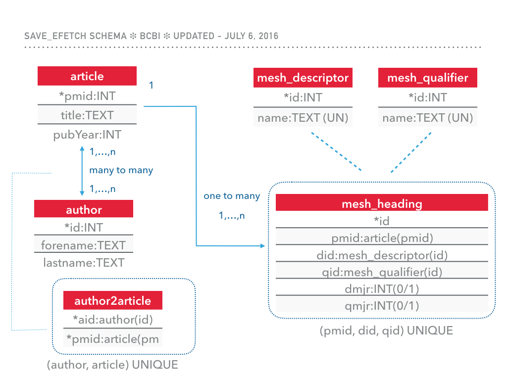

Utility functions to parse and store PubMed searches via [BioServices.EUtils](http://biojulia.net/BioServices.jl/latest/man/eutils)

## Import Module

```
using BioMedQuery.PubMed
```

This module provides utility functions to parse, store and export queries to PubMed via the NCBI EUtils and its julia interface [BioServices.EUtils](http://biojulia.net/BioServices.jl/latest/man/eutils). For many purposes you may interact with the higher level pipelines in [BioMedQuery.Processes]. Here, some of the lower level functions are discussed in case you need to assemble different pipelines.


## Basics of searching PubMed

We are often interseted in searching PubMed for all articles related to a search term, and possibly restricted by other search criteria. To do so we use [BioServices.EUtils](http://biojulia.net/BioServices.jl/latest/man/eutils). A basic example of how we may use the functions `esearch` and `efetch` to accomplish such task is illustrated below.

```julia
using BioServices.EUtils
using XMLDict

search_term = "obstructive sleep apnea[MeSH Major Topic]"

#esearch
esearch_response = esearch(db="pubmed", term = search_term,
retstart = 0, retmax = 20, tool ="BioJulia")

#convert xml to dictionary
esearch_dict = parse_xml(String(esearch_response.data))

#convert id's to a array of numbers
ids = [parse(Int64, id_node) for id_node in esearch_dict["IdList"]["Id"]]

#efetch
efetch_response = efetch(db = "pubmed", tool = "BioJulia", retmode = "xml", rettype = "null", id = ids)

#convert xml to dictionary
efetch_dict = parse_xml(String(efetch_response.data))
```


## Handling XML responses

Many APIs return responses in XML form. 

To parse an XML to a Julia dictionary we can use the XMLDict package

```julia
using XMLDict
dict = parse_xml(String(response.data))  
```

You can save directly the XML String to file using LightXML

```julia
xdoc = parse_string(esearch)
save_file(xdoc, "./file.xml")
```
---

## Save eseach/efetch responses 

### Save PMIDs to MySQL

If we are only interseted in saving a list of PMIDs associated with a query, we can do so as follows

```julia        
dbname = "entrez_test"
config = Dict(:host=>"127.0.0.1", :dbname=>dbname, :username=>"root",
:pswd=>"", :overwrite=>true)
con = PubMed.save_pmid_mysql(ids, config, false)

# get array of PMIDS store in database
all_pmids = BioMedQuery.PubMed.all_pmids(con)
```


### Export efetch response as EndNote citation file

We can export the information returned by efetch as and EndNote/BibTex library file

```julia
config = Dict(:type => "endnote", :output_file => "./citations_temp.endnote", :overwrite=>true)
nsucceses = BioMedQuery.PubMed.save_article_citations(efetch_dict, config, verbose)
```

### Save efetch response to MySQL database

Save the information returned by efetch to a MySQL database

```julia
dbname = "entrez_test"
config = Dict(:host=>"127.0.0.1", :dbname=>dbname, :username=>"root",
:pswd=>"", :overwrite=>true)
@time db = BioMedQuery.PubMed.save_efetch_mysql(efetch_dict, config, verbose)
```

### Save efetch response to SQLite database

Save the information returned by efetch to a MySQL database

 ```julia
verbose = false
db_path = "./test_db.db"

config = Dict(:db_path=> db_path, :overwrite=>true)
db = BioMedQuery.PubMed.save_efetch_sqlite(efetch_dict, config, verbose)
```

### Exploring output databases

The following schema has been used to store the results. If you are interested in having this module store additional fields, feel free to open an issue		
	


We can als eexplore the tables using BioMedQuery.DBUtils, e,g

```julia
tables = ["author", "author2article", "mesh_descriptor",
"mesh_qualifier", "mesh_heading"]

for t in tables
    query_str = "SELECT * FROM "*t*" LIMIT 10;"
    q = BioMedQuery.DBUtils.db_query(db, query_str)
    println(q)
end
```

---
## Index

```@index
Modules = [BioMedQuery.PubMed]
```

## Structs and Functions

```@autodocs
Modules = [BioMedQuery.PubMed]
Order   = [:struct, :function]
```